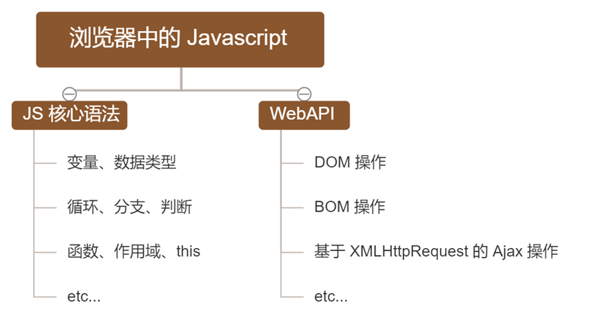
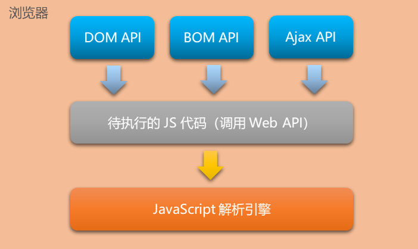
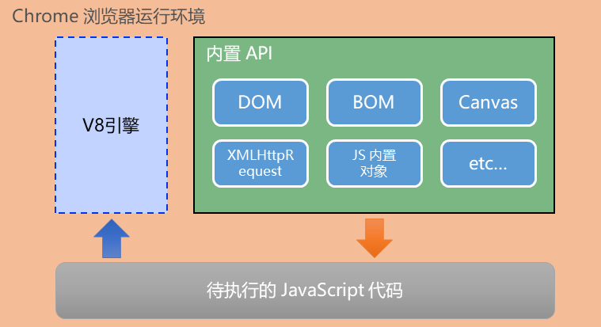

# 1.初识 Node.js

### 1.1 浏览器中的 JavaScript 的组成部分

### 1.2 为什么 JavaScript 可以在浏览器中被执行？

​     不同的浏览器使用不同的 JavaScript 解析引擎

- Chrome 浏览器 => V8

- Firefox 浏览器 => OdinMonkey（奥丁猴）

- Safri浏览器 => JSCore

- IE 浏览器 => Chakra（查克拉）

  其中，Chrome 浏览器的 V8 解析引擎性能最好！

### 1.3 为什么 JavaScript 可以操作 DOM 和 BOM？

- 每个浏览器都内置了 DOM、BOM 这样的 API 函数，因此，浏览器中的 JavaScript 才可以调用它们

浏览器中的 JavaScript 运行环境

- 运行环境是指代码正常运行所需的必要环境

  

#### **总结**：

- V8 引擎负责解析和执行 JavaScript 代码
- 内置 API 是由运行环境提供的特殊接口，只能在所属的运行环境中被调用

### 1.4 JavaScript能否做后端开发？

需要node.js

### 1.5 什么是 Node.js

 Node.js 是一个基于 Chrome V8 引擎的 JavaScript 运行环境
官网地址 https://nodejs.org/zh-cn/

### 1.6 Node.js 中的 JavaScript 运行环境

1. 浏览器是 JavaScript 的前端运行环境

2. Node.js 是 JavaScript 的后端运行环境
3. Node.js 中无法调用 DOM 和 BOM 等浏览器内置 API

### 1.7 Node.js 可以做什么

Node.js 作为一个 JavaScript 的运行环境，仅仅提供了基础的功能和 API。然而，基于 Node.js 提供的这些基础能，很多强大的工具和框架如雨后春笋，层出不穷，所以学会了 Node.js ，可以让前端程序员胜任更多的工作和岗位

1. a基于 Express 框架 http://www.expressjs.com.cn/ 可以快速构建 Web 应用
2. b基于 Electron 框架 https://electronjs.org/ 可以构建跨平台的桌面应用
3. c基于 restify 框架 http://restify.com/ 可以快速构建 API 接口项目
4. d读写和操作数据库、创建实用的命令行工具辅助前端开发、etc…

### 1.8 Node.js 怎么学

####  浏览器中的 JavaScript 学习路径

JavaScript 基础语法 + 浏览器内置 API（DOM + BOM） + 第三方库（jQuery、art-template 等）

####  Node.js 的学习路径

JavaScript 基础语法 + Node.js 内置 API（fs、path、http等）+ 第三方 API 模块（express、mysql 等）
shift+鼠标右键 可以在该目录下打开powershell窗口

在powershell中的快捷键：

| 按键  | 作用                                                         |
| ----- | ------------------------------------------------------------ |
| ⬆     | 可以快速定位到上一次执行的命令。                             |
| tab键 | 可以快速补全文件的路径（先输入第一个字，然后使用tab键，可以快速补全路径） |
| ESC   | 可以快速清空已输入的命令                                     |
| cls   | 清空powershell面板                                           |

> tips：./表示为当前目录，写不写都可以