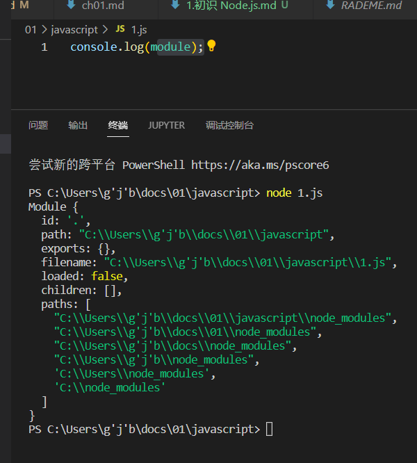
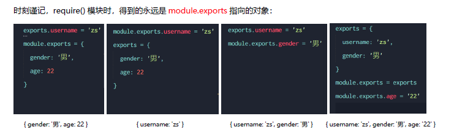

# 4. 模块化

### 4.1 模块化的基本概念

**模块化**：是指解决一个复杂问题时，自顶向下逐层把系统划分成若干模块的过程。对于整个系统来说，模块是可组合、分解和更换的单元
编程领域中的模块化，就是遵守固定的规则，把一个大文件拆成独立并互相依赖的多个小模块。
把代码进行模块化拆分的好处

1. 提高了代码的复用性
2. 提高了代码的可维护性
3. 可以实现按需加载

**模块化规范**：就是对代码进行模块化的拆分与组合时，需要遵守的那些规则。例如使用什么样的语法格式来引用模块，在模块中使用什么样的语法格式向外暴露成员
**模块化规范的好处**：大家都遵守同样的模块化规范写代码，降低了沟通的成本，极大方便了各个模块之间的相互调用，利人利己。

### 4.2 模块的分类&require()方法的使用

Node.js 中根据模块来源的不同，将模块分为了 3 大类

1. 内置模块（内置模块是由 Node.js 官方提供的，例如 fs、path、http 等）
2. 自定义模块（用户创建的每个 js 文件，都是自定义模块）
3. 第三方模块（由第三方开发出来的模块，使用前需要先下载）

**使用require()方法加载模块**
使用强大的 require()方法，可以加载需要的内置模块、用户自定义模块、第三方模块进行使用

> 注意：使用 require() 方法加载其它模块时，会执行被加载模块中的代码

```js
const fs = require('fs')							// 内置模块
const custom = require('./custom.js')	// 自定义模块，需指明路径，可以省略 .js 的后缀名
const moment = require('moment')			// 第三方模块
```


### 4.3 模块作用域

模块作用域：和函数作用域类似，在自定义模块中定义的变量、方法等成员，只能在当前模块内被访问，这种模块级别的访问限制
**模块作用域的好处**：防止了全局变量污染的问题

```js
// 模块作用域
const username = '张三'
function sayHello() {
  console.log('大家好，我是' + username)
}
```

```js
const custom = require('./模块作用域')
console.log(custom)
```

输出是空对象，说明模块内定义的变量只能在**模块内**被访问。


### 4.4 module对象和exports对象

在每个 .js 自定义模块中都有一个module对象，它里面存储了和当前模块有关的信息



**module.exports 对象**
在自定义模块中，可以使用module.exports对象，将模块内的成员**共享**出去，供外界使用
外界用 require() 方法导入自定义模块时，得到的就是 module.exports 所指向的对象，而一般默认该属性是{}即空对象。

```js
// 在一个自定义模块中，默认情况下， module.exports = {}

const age = 20

// 向 module.exports 对象上挂载 username 属性
module.exports.username = 'zs'
// 向 module.exports 对象上挂载 sayHello 方法
module.exports.sayHello = function() {
  console.log('Hello!')
}
module.exports.age = age//再共享出去

// 让 module.exports 指向一个全新的对象
module.exports = {
  nickname: '小黑',
  sayHi() {
    console.log('Hi!')
  }
}
```

**exports 和 module.exports 的使用误区**

-   由于 module.exports 单词写起来比较复杂，为了简化向外共享成员的代码，Node 提供了 exports 对象。默认情况下，exports 和 module.exports 指向同一个对象。最终共享的结果，还是以 module.exports 指向的对象为准。

-   时刻谨记，require() 模块时，得到的永远是 module.exports 指向的对象，若出现exports 和 module.exports，最终不管exports怎么指向，都输出module.exports。注意挂载属性和指向新对象的区别。

  

> 注意：为了防止混乱，建议大家不要在同一个模块中同时使用 exports 和 module.exports

```js
// 在一个自定义模块中，默认情况下， module.exports = {}

const age = 20

// 向 module.exports 对象上挂载 username 属性
module.exports.username = 'zs'
// 向 module.exports 对象上挂载 sayHello 方法
module.exports.sayHello = function() {
  console.log('Hello!')
}
module.exports.age = age

// 让 module.exports 指向一个全新的对象 
module.exports = {
  nickname: '小黑',
  sayHi() {
    console.log('Hi!')
  }
}

```

```js
// 在外界使用 require 导入一个自定义模块的时候，得到的成员，
// 就是 那个模块中，通过 module.exports 指向的那个对象
const m = require('./11.自定义模块')

console.log(m)
```


### 4.5 Node.js 中的模块化规范

Node.js 遵循了 CommonJS 模块化规范，CommonJS 规定了模块的特性和各模块之间如何相互依赖

- 每个模块内部，module 变量代表当前模块
- module 变量是一个对象，它的 exports 属性（即 module.exports）是对外的接口
- 加载某个模块，其实是加载该模块的 module.exports 属性。require() 方法用于加载模块


### 4.6 模块加载机制

模块在第一次加载后会被缓存，多次调用 **require()** 模块的代码只会被执行一次。不论是内置模块、用户自定义模块、还是第三方模块，它们都会优先从缓存中加载，从而提高模块的加载效率。

**内置模块的加载机制**

内置模块的加载优先级最高（当第三方模块和内置模块同名时）

**自定义模块的加载机制**

使用 require() 加载自定义模块时，必须指定以 ./ 或 …/ 开头的路径标识符。在加载自定义模块时，如果没有指定 ./ 或 …/ 这样的路径标识符，则 node 会把它当作内置模块或第三方模块进行加载。

在使用 require() 导入自定义模块时，如果省略了文件的扩展名，Node.js 会按顺序分别尝试加载以下的文件

1. 按照确切的文件名进行加载
2.  补全 .js 扩展名进行加载
3.  补全 .json 扩展名进行加载
4.  补全 .node 扩展名进行加载
5.  加载失败，终端报错

**第三方模块的加载机制**

如果传递给 require() 的模块标识符不是一个内置模块，也没有以 ./ 或 …/ 开头，则 Node.js 会从当前模块的父目录开始，尝试从 /node_modules 文件夹中加载第三方模块

- 如果没有找到对应的第三方模块，则移动到再上一层父目录中，进行加载，直到文件系统的根目录
-  假设在 ‘C:\Users\itheima\project\node_modules\a.js’ 里调用 require(‘tools’)，Node.js 会按以下顺序查找

1. C:\Users\itheima\project\node_modules\tools
2. C:\Users\itheima\node_modules\tools
3. C:\Users\node_modules\tools
4. C:\node_modules\tools
5. 报错

**目录作为模块**

当把目录作为模块标识符，传递给 require() 进行加载的时候，有三种加载方式

1. 在被加载的目录下查找一个叫做 package.json 的文件，并寻找 main 属性值作为 require() 加载的入口
2. 如果目录里没有 package.json 文件，或者 main 入口不存在或无法解析，则 Node.js 将会试图加载目录下的 index.js 文件
3. 如果以上两步都失败了，则 Node.js 会在终端打印错误消息，报告模块的缺失：Error: Cannot find module ‘xxx’
