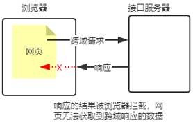
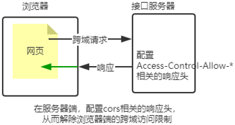

# 7. 编写接口及跨域问题


### 7.1 创建基本的服务器

```js
// 导入 express
const express = require('express')
// 创建服务器实例
const app = express()
//

........

//
// 启动服务器
app.listen(80, () => {
  console.log('express server running at http://127.0.0.1')
})

```

### 7.2 创建API路由模块

```js
// Router.js(路由模块)
const express = require('express')
const router = express.Router()
// 在这里挂载对应的路由
。。。
。。。
module.exports = Router(暴露出去)


//app.js(导入并注册路由模块)
const apiRouter = require('./Router.js')
app.use('/api', Router)
```

### 7.3 编写GET接口

```js
router.get('/get', (req, res) => {
  // 通过 req.query 获取客户端通过查询字符串，发送到服务器的数据
  const query = req.query
  // 调用 res.send() 方法，向客户端响应处理的结果
  res.send({
    status: 0, // 0 表示处理成功，1 表示处理失败
    msg: 'GET 请求成功！', // 状态的描述
    data: query, // 需要响应给客户端的数据
  })
})
```

### 7.4 编写POST接口

```js

router.post('/post', (req, res) => {
  // 通过 req.body 获取请求体中包含的 url-encoded 格式的数据
  const body = req.body
  // 调用 res.send() 方法，向客户端响应结果
  res.send({
    status: 0,
    msg: 'POST 请求成功！',
    data: body,
  })
})
```

### 7.5 跨域问题

刚才编写的 GET 和 POST接口，存在一个很严重的问题：不支持跨域请求，解决接口跨域问题的方案主要有两种

- CORS（主流解决方案，推荐）
- JSONP（有缺陷：只支持 GET 请求）

**使用 CORS 中间件解决跨域问题**
**CORS**（Cross-Origin Resource Sharing，跨域资源共享）是 Express 的一个第三方中间件，**由一系列 HTTP 响应头组成，这些 HTTP 响应头决定浏览器是否阻止前端 JS 代码跨域获取资源。可以很方便地解决跨域问题。**

浏览器的同源安全策略默认会阻止网页“跨域”获取资源。但如果**接口服务器配置了 CORS 相关的 HTTP 响应头**，就可以解除浏览器端的跨域访问限制。





**cors使用步骤**

1. 运行 npm install cors 安装中间件
2. 使用 const cors = require(‘cors’) 导入中间件
3. 在路由之前调用 app.use(cors()) 配置中间件

> CORS 在服务器端进行配置，客户端浏览器无须做任何额外的配置，即可请求开启了 CORS 的接口。
> CORS 在浏览器中有兼容性，只有支持 XMLHttpRequest Level2 的浏览器，才能正常访问开启了 CORS 的服务端接口（如：IE10+、Chrome4+、FireFox3.5+）

**响应头：**

响应头部可以携带一个Access-Control-Allow-Origin字段，语法如下：

```js
Access-Control-Allow-Origin: <origin> | *
```

其中，origin 参数的值指定了允许访问该资源的外域 URL,可以控制哪些网页可以请求该服务器,示例代码如下：

```js
res.setHeader('Access-Control-Allow-Origin', 'http....')
```

如果指定了 Access-Control-Allow-Origin 字段的值为通配符 *****，表示允许来自任何域的请求，示例代码如下：

```js
res.setHeader('Access-Control-Allow-Origin', '*')
```


**Access-Control-Allow-Headers** 

默认情况下，CORS 仅支持客户端向服务器发送如下的 **9 个请求头**

Accept、Accept-Language、Content-Language、DPR、Downlink、Save-Data、Viewport-Width、Width 、Content-Type （值仅限于 text/plain、multipart/form-data、application/x-www-form-urlencoded）

如果客户端向服务器发送了额外的请求头信息，则需要在服务器端，通过 `Access-Control-Allow-Headers` 对额外的请求头进行声明，否则这次请求会失败！

```js
res.setHeader('Access-Control-Allow-Headers', 'Content-Type, X-custom-Header')
```


**Access-Control-Allow-Methods**：（更多的请求方式）

默认情况下，CORS 仅支持客户端发起 GET、POST、HEAD 请求。
如果客户端希望通过 PUT、DELETE 等方式请求服务器的资源，则需要在服务器端，通过 Access-Control-Alow-Methods来指明实际请求所允许使用的 HTTP 方法

```
res.setHeader('Access-Control-Allow-Methods', 'POST, GET, PUT, DELETE')

res.setHeader('Access-Control-Allow-Methods', '*')	// 支持所有请求
```


##### CROS**请求分类**

客户端在请求 CORS 接口时，根据请求方式和请求头的不同，可以将 CORS 的请求分为两大类：

**1.简单请求**

同时满足以下两大条件的请求，就属于简单请求

- 请求方式：GET、POST、HEAD 三者之一
- HTTP 头部信息不超过以下几种字段：无自定义头部字段、Accept、Accept-Language、Content-Language、DPR、Downlink、Save-Data、Viewport-Width、Width 、Content-Type（只有三个值application/x-www-form-urlencoded、multipart/form-data、text/plain）

**2.预检请求**

只要符合以下任何一个条件的请求，都需要进行预检请求

- 请求方式为 GET、POST、HEAD 之外的请求 Method 类型
- 请求头中包含自定义头部字段
- 向服务器发送了 application/json 格式的数据

在浏览器与服务器正式通信之前，浏览器会**先**发送 **OPTION 请求**进行**预检**，以获知服务器是否允许该实际请求，这一次的 OPTION 请求称为**预检请求**。服务器成功响应预检请求后，才会发送真正的请求，并且携带真实数据。

**简单请求的特点**：客户端与服务器之间只会发生一次请求
**预检请求的特点**：客户端与服务器之间会发生两次请求，OPTION 预检请求成功之后，才会发起真正的请求

```js
// apiRouter.js

const express = require('express')
const router = express.Router()

// GET 接口
router.get('/get', (req, res) => {
  // 通过 req.query 获取客户端发送到服务器的数据
  const query = req.query
  res.send({
    status: 0,						// 0 表示处理成功，1 表示处理失败
    msg: 'GET 请求成功！',	// 状态的描述
    data: query,					// 需要响应给客户端的数据
  })
})

// POST 接口
router.post('/post', (req, res) => {
  // 通过 req.body 获取请求体中包含的 url-encoded 格式的数据
  // 意在路由模块之前配置中间件url-encoded
  const body = req.body
  res.send({
    status: 0,
    msg: 'POST 请求成功！',
    data: body,
  })
})

// DELETE 接口
router.delete('/delete', (req, res) => {
  res.send({
    status: 0,
    msg: 'DELETE请求成功',
  })
})

module.exports = router
```


**JSONP 接口（有缺陷只支持GET）**

概念：浏览器端通过

**实现 JSONP 接口的步骤**：

1. 获取客户端发送过来的**回调函数的名字**
2. 得到要通过 JSONP 形式发送给**客户端的数据**
3. 根据前两步得到的数据，**拼接出一个函数调用的字符串**
4. 把上一步拼接得到的字符串，**响应给客户端的**

```js
const express = require('express')

const app = express()

// 配置解析表单数据的中间件
app.use(express.urlencoded({ extended: false }))

// 必须在配置 cors 中间件之前，配置 JSONP 的接口
app.get('/api/jsonp', (req, res) => {
  // 定义 JSONP 接口具体的实现过程
  const funcName = req.query.callback	// 1. 得到函数的名称
  const data = { name: 'zs', age: 22 }	// 2. 定义要发送到客户端的数据对象
  const scriptStr = `${funcName}(${JSON.stringify(data)})`	// 3. 拼接出一个函数的调用
  res.send(scriptStr)		// 4. 把拼接的字符串，响应给客户端
})

// 一定要在路由之前，配置 cors 这个中间件，从而解决接口跨域的问题
const cors = require('cors')
app.use(cors())

// 导入路由模块
const router = require('./16.apiRouter')
// 把路由模块，注册到 app 上
app.use('/api', router)

app.listen(80, () => {console.log('express server running at http://127.0.0.1')})
```

**测试模块**

```js
<!DOCTYPE html>
<html lang="en">
  <head>
    <meta charset="UTF-8" />
    <meta name="viewport" content="width=device-width, initial-scale=1.0" />
    <title>Document</title>
    <script src="https://cdn.staticfile.org/jquery/3.4.1/jquery.min.js"></script>
  </head>
  <body>
    <button id="btnGET">GET</button>
    <button id="btnPOST">POST</button>
    <button id="btnDelete">DELETE</button>
    <button id="btnJSONP">JSONP</button>

    <script>
      $(function () {
        // 1. 测试GET接口
        $('#btnGET').on('click', function () {
          $.ajax({
            type: 'GET',
            url: 'http://127.0.0.1/api/get',
            data: { name: 'cess', age: 18 },
            success: function (res) {
              console.log(res)
            },
          })
        })
        // 2. 测试POST接口
        $('#btnPOST').on('click', function () {
          $.ajax({
            type: 'POST',
            url: 'http://127.0.0.1/api/post',
            data: { bookname: '开端', author: '祈祷君' },
            success: function (res) {
              console.log(res)
            },
          })
        })

        // 3. 为删除按钮绑定点击事件处理函数
        $('#btnDelete').on('click', function () {
          $.ajax({
            type: 'DELETE',
            url: 'http://127.0.0.1/api/delete',
            success: function (res) {
              console.log(res)
            },
          })
        })

        // 4. 为 JSONP 按钮绑定点击事件处理函数
        $('#btnJSONP').on('click', function () {
          $.ajax({
            type: 'GET',
            url: 'http://127.0.0.1/api/jsonp',
            dataType: 'jsonp',
            success: function (res) {
              console.log(res)
            },
          })
        })
      })
    </script>
  </body>
</html>
```

