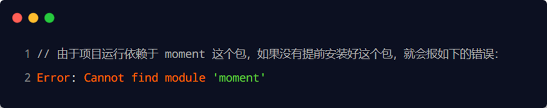
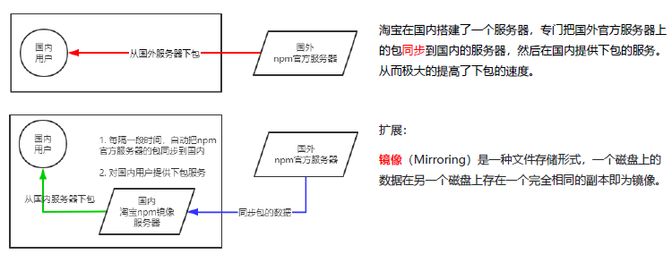

# 5.包与npm


### 5.1 包的概念

`Node.js` 中的第三方模块又叫做包

不同于 `Node.js` 中的内置模块与自定义模块，包是由第三方个人或团队开发出来的，免费供所有人使用。`Node.js` 中的包都是免费且开源的

- 由于 `Node.js` 的内置模块仅提供了一些底层的 API，导致在基于内置模块进行项目开发的时，效率很低
- 包是基于内置模块封装出来的，提供了更高级、更方便的 API，极大的提高了开发效率
- 包和内置模块之间的关系，类似于 jQuery和 浏览器内置 API 之间的关系


### 5.2 下载包

国外有一家 IT 公司，叫做 npm, Inc. 这家公司旗下有一个非常著名的网站 https://www.npmjs.com/，它是全球最大的包共享平台，你可以从这个网站上搜索到任何你需要的包，只要你有足够的耐心！到目前位置，全球约1100多万的开发人员，通过这个包共享平台，开发并共享了超过120多万个包 供我们使用。npm, Inc. 公司提供了一个地址为 https://registry.npmjs.org/ 的服务器，来对外共享所有的包，我们可以从这个服务器上下载自己所需要的包。

- 从 https://www.npmjs.com/网站上搜索自己所需要的包
- 从 https://registry.npmjs.org/ 服务器上下载自己需要的包


### 5.3 包的初体验

**格式化时间的传统做法**

1. 创建格式化时间的自定义模块
2. 定义格式化时间的方法
3. 创建补零函数
4. 从自定义模块中导出格式化时间的函数
5. 导入格式化时间的自定义模块
6. 调用格式化时间的函数

```js
// dateFormat.js

// 1. 定义格式化时间的方法
function dateFormat(dtStr) {
  const dt = new Date(dtStr)

  const y = dt.getFullYear()
  const m = padZero(dt.getMonth() + 1)
  const d = padZero(dt.getDate())
  const hh = padZero(dt.getHours())
  const mm = padZero(dt.getMinutes())
  const ss = padZero(dt.getSeconds())

  return `${y}-${m}-${d} ${hh}:${mm}:${ss}`
}

// 定义补零的函数
function padZero(n) {
  return n > 9 ? n : '0' + n
}

module.exports = {
  dateFormat
}
```

```js
// 导入自定义的格式化时间的模块
const TIME = require('./dateFormat')

// 调用方法，进行时间的格式化
const dt = new Date()
// console.log(dt)
const newDT = TIME.dateFormat(dt)
console.log(newDT)
```

**格式化时间的高级做法**

1. 使用npm包管理工具，在项目中安装格式化时间的包moment
2. 使用require()导入格式化时间的包
3. 参考moment的官方API文档对时间进行格式化

```js
// 1. 导入需要的包
// 注意：导入的名称，就是装包时候的名称
const moment = require('moment')
//查文档看用法
const dt = moment().format('YYYY-MM-DD HH:mm:ss')//对时间进行格式化
console.log(dt)
```


### 5.4 在项目中安装包

```
npm install 包的完整名称
或者
npm i 包的完整名称
npm i 包的完整名称 包的完整名称（加空格可以安装多个包）
```

初次装包完成后，在项目文件夹下多一个叫做 node_modules 的文件夹和 package-lock.json 的配置文件。

- **node_modules** 文件夹用来存放所有已安装到项目中的包。require() 导入第三方包时，从这个目录中查找并加载
- **package-lock.json** 配置文件用来记录 node_modules 目录下的每一个包的下载信息，例如包的名字、版本号、下载地址等

```
{
  "requires": true,
  "lockfileVersion": 1,
  "dependencies": {
    "moment": {
      "version": "2.29.1",
      "resolved": "https://registry.npmjs.org/moment/-/moment-2.29.1.tgz",
      "integrity": "sha512-kHmoybcPV8Sqy59DwNDY3Jefr64lK/by/da0ViFcuA4DH0vQg5Q6Ze5VimxkfQNSC+Mls/Kx53s7TjP1RhFEDQ=="
    }
  }
}
```

> **注意**：不要手动修改 node_modules 或 package-lock.json文件中的任何代码，npm 包管理工具会自动维护它们


### 5.5 安装指定版本的包

npm install 命令默认安装最新版本的包。如需安装指定版本的包，在包名之后@

```
npm i 包的完整名称@版本号
```

> tips:不用删除以前的版本，npm会自动覆盖之前的版本。

**关于版本号**

包的版本号以“点分十进制”形式进行定义，总共有三位数字，如 2.24.0。其中每一位数字所代表的的含义如下

- 第1位数字：**大版本**
- 第2位数字：**功能版本**
- 第3位数字：**Bug修复版本**

版本号提升的规则：只要前面的版本号增长了，则后面的版本号归零


### 5.6 包管理配置文件

npm规定，**在项目根目录中**，必须提供一个叫做 package.json 的包管理配置文件。用来记录与项目有关的一些配置信息。如

- 项目的名称、版本号、描述等
- 项目中都用到了哪些包
- 哪些包只在开发期间会用到
- 哪些包在开发和部署时都需要用到


**多人协作的问题**

遇到的问题：第三方包的体积过大，不方便团队成员之间共享项目源代码。

解决方案：共享时剔除 node_modules


**如何记录项目中安装了哪些包**

在项目根目录 package.json 的配置文件用来记录项目中安装了哪些包。从而方便剔除 node_modules 目录之后，在团队成员之间共享项目的源代码

> 注意：今后在项目开发中，一定要把 node_modules文件夹，添加到 .gitignore 忽略文件中
>


**快速创建 package.json**

npm 包管理工具提供了一个快捷命令，可以在执行命令时所处的目录中，快速创建 package.json 这个包管理配置文件。

```
npm init -y
```

<u>在新建项目文件夹以后就执行该命令，项目开发期间只用执行这一次就行。</u>


**注意事项：**

- 上述命令只能在英文的目录下成功运行！所以项目文件夹的名称一定要使用英文命名，不能出现空格


- 运行 npm install 命令安装包的时候，npm包管理工具会自动把包的名称和版本号，记录到 package.json


**package.json 文件中的 dependencies 节点，专门用来记录您使用 npm install 命令安装了哪些包**

```
{
  "name": "test",
  "version": "1.0.0",
  "description": "",
  "main": "index.js",
  "scripts": {
    "test": "echo \"Error: no test specified\" && exit 1"
  },
  "keywords": [],
  "author": "",
  "license": "ISC",
  "dependencies": {
    "art-template": "^4.13.2",
    "jquery": "^3.6.0",
    "moment": "^2.29.1"
  }
}

```


### 5.7 一次性安装所有包

拿到一个剔除了 node_modules 的项目之后，需要先把所有的包下载到项目中，才能将项目运行起来。否则会报类似于下面的错误



可以运行 `npm install` 命令（或 npm i）一次性安装所有的依赖包

```
npm install
```


### 5.8 卸载包

运行 `npm uninstall` 命令，来卸载指定的包

```
npm uninstall 包名
```

`npm uninstall` 命令执行成功后，会把卸载的包，自动从 package.json 的 dependencies 中移除掉


**devDependencies节点**

如果某些包只在项目开发阶段会用到，在项目上线之后不会用到，则建议把这些包记录到 devDependencies节点中。如果某些包在开发和项目上线之后都需要用到，则建议把这些包记录到 dependencies 节点中。可以使用如下的命令，将包记录到 devDependencies节点中。

```
//完整写法 包名和--save-dev顺序不重要
npm install 包名 --save-dev     
或
//常用简写
npm i 包名 -D
```


### 5.9 使用镜像解决包下载慢的问题

1. npm 下包的时候，默认从国外的 https://registry.npmjs.org/ 服务器进行下载，可能会慢
2. 使用国内镜像服务器-淘宝，大幅改善下载速度



镜像的原理原理如上图

**切换npm的下包镜像源**

```
npm config get registry 	# 查看当前包镜像源
npm config set registry=http://registry.npm.taobao.org/ # 切换源头
npm config get registry 	# 检查镜像源是否下载成功
```

为了方便的切换下包的镜像源，可以安装**nrm**小工具，利用 nrm 提供的终端命令，快速查看和切换下包的镜像源

```
npm install nrm -g	# -g 全局可用
nrm ls							# 查看当前可用的镜像源地址list
nrm use taobao			# 切换镜像源
```


### 5.10 包的分类

使用 npm 包管理工具下载的包，共分为两大类，分别是

1.**项目包**

那些被安装到项目的 node_modules 目录中的包，都是项目包。项目包又分为两类

开发依赖包（被记录到 devDependencies节点中的包，只在开发期间会用到）npm i 包名 -D

核心依赖包（被记录到 dependencies节点中的包，在开发期间和项目上线之后都会用到）npm i 包名

2.**全局包**

在执行 npm install 命令时，如果提供了 -g 参数，则会把包安装为全局包

全局包会被安装到 C:\Users\用户目录\AppData\Roaming\npm\node_modules 目录下

```
npm install 包名 -g	# 全局安装指定的包
npm uninstall 包名 -g	# 卸载全局指定的包
```

> - **只有工具性质的包，才有全局安装的必要性**。因为它们提供了好用的终端命令
> - 判断某个包是否需要全局安装后才能使用，可以参考官方提供的使用说明即可


**规范的包结构**
一个规范的包，它的组成结构，必须符合以下 3 点要求

1. 包必须以单独的目录而存在
2. 包的顶级目录（点进去的目录）下要必须包含 package.json 这个包管理配置文件
3. package.json 中必须包含 name，version，main这三个属性，分别代表包的名字、版本号、包的入口(.js文件)（require()加载的文件）

关于更多的约束参考 https://yarnpkg.com/zh-Hans/docs/package-json


### 5.11 开发包与发布包

1. 新建 itheima-tools 文件夹，作为包的根目录
2. 在 itheima-tools 文件夹中新建。**也可以直接初始化（npm init -y）**

**package.json （包管理配置文件）**

```
{
  "name": "itheima-tools",
  "version": "1.1.0",
  "main": "index.js",
  "description": "提供了格式化时间、HTMLEscape相关的功能",//检索时出现的功能介绍
  "keywords": [//搜索关键词
    "itheima",
    "dateFormat",
    "escape"
  ],
  "license": "ISC"//协议
}
```

**index.js** （**包的入口文件**）

```js
// src 文件夹下开发代码，导入到 index.js 中
const date = require('./src/dateFormat')
const escape = require('./src/htmlEscape')

// 向外暴露需要的成员
module.exports = {
  ...date,		// ... 展开运算符，将data所有属性交给新对象
  ...escape		// ... 展开运算符，将escape所有属性交给新对象
}
```

**src 源代码**

```js
// dateFormat.js

function dateFormat(dateStr) {/* 略 */}
function padZero(n) {return n > 9 ? n : '0' + n}

module.exports = {
  dateFormat
}
```

```js
// htmlEscape.js

function htmlEscape(htmlstr) {/* 略 */}
function htmlUnEscape(str) {/* 略 */}

module.exports = {
  htmlEscape,
  htmlUnEscape
}
```

**README.md （包的说明文档）**

````
## 安装
```
npm install itheima-tools
```

## 导入
```js
const itheima = require('itheima-tools')
```

## 格式化时间
```js
// 调用 dateFormat 对时间进行格式化
const dtStr = itheima.dateFormat(new Date())
// 结果  2020-04-03 17:20:58
console.log(dtStr)
```

## 转义 HTML 中的特殊字符
```js
略
```

## 还原 HTML 中的特殊字符
```js
略
```

## 开源协议
ISC
````

**使用**

```js
const itheima = require('./itheima-tools')

// 格式化时间的功能
const dtStr = itheima.dateFormat(new Date())
console.log(dtStr)
console.log('-----------')

const htmlStr = '<h1 title="abc">这是h1标签<span>123&nbsp;</span></h1>'
const str = itheima.htmlEscape(htmlStr)
console.log(str)
console.log('-----------')

const str2 = itheima.htmlUnEscape(str)
console.log(str2)
```


**发布包**

1.https://www.npmjs.com/ 注册 npm 账号

2.在终端登录，终端中执行 npm login 命令，依次输入用户名、密码、邮箱后，即可登录成功

>  注意：执行命令前，必须先把下包的服务器地址切换为 npm 的官方服务器。否则会导致发布包失败！先用nrm命令检查一下，nrm use 命令切换。

3.终端切换到包的根目录之后，运行 npm publish 命令，即可将包发布到 npm 上（注意：包名不能雷同）

4.运行 npm unpublish 包名 --force命令，即可从 npm 删除已发布的包

- npm unpublish 命令只能删除 72 小时以内发布的包

- npm unpublish 删除的包，在 24 小时内不允许重复发布

- 发布包的时候要慎重，尽量不要往 npm 上发布没有意义的包

  