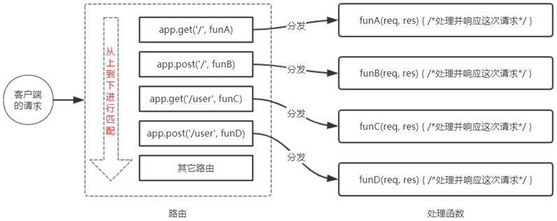
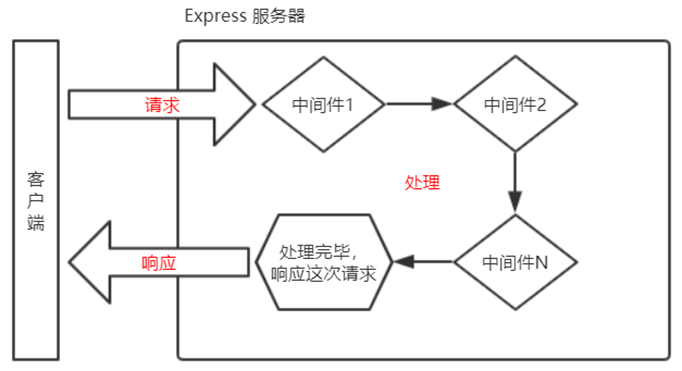
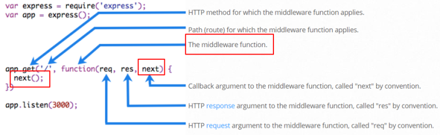
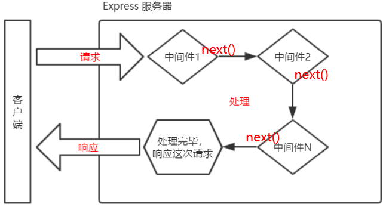

# 6.Express介绍与使用


### 6.1 express介绍

Express 是基于 Node.js 平台，快速、开放、极简的 Web 开发框架
通俗的理解：Express 的作用和 Node.js 内置的 http 模块类似，是专门用来创建 Web 服务器的。
本质就是一个 npm 上的第三方包，提供了快速创建 Web 服务器的便捷方法
中文官网 http://www.expressjs.com.cn/

**不使用 Express 能否创建 Web 服务器？**

能，使用 Node.js 提供的原生 http 模块即可

**有了 http 内置模块，为什么还有用 Express？**

1. http 内置模块用起来很复杂，开发效率低
2. Express 是基于内置的 http 模块进一步封装出来的，能够极大的提高开发效率

**http 内置模块与 Express 是什么关系？**

类似于浏览器中 Web API 和 jQuery 的关系。后者是基于前者进一步封装出来的

对于前端程序员来说，最常见的两种服务器，分别是

1. Web 网站服务器：专门对外提供 Web 网页资源的服务器
2. API 接口服务器：专门对外提供 API 接口的服务器

使用 Express，我们可以方便、快速的**创建 Web 网站的服务器或 API 接口的服务器**


### 6.2 express基本使用

1.在项目所处的目录中安装

```
npm i express@4.17.1
```

2.创建基本的 Web 服务器

```js
const express = require('express');	// 导入express
                        
const app = express();							// 创建web服务器

app.listen(80, () => {							// 调用回调函数，listen() 启动服务器
	console.log('express server running at http://127.0.0.1')
});
```

3.处理请求

```js
// 监听 GET 请求
app.get('url', function(req, res) { /*处理函数*/ })

// 监听 POST 请求
app.post('url', function(req, res) { /*处理函数*/ })

app.post('url', function(req, res){
  // 通过 req.query 对象，可以访问到客户端通过查询字符串的形式，发送到服务器的参数
  console.log(req.query)
  
  // 通过 req.params 对象，可以访问到 URL 中，通过 : 匹配到的动态参数
  console.log(req.parms)
  
  // 通过 res.send()方法，把处理好的内容发送给客户端
  res.send(data);
})

```

4.完整实例

```js
// 1. 导入 express
const express = require('express')
// 2. 创建 web 服务器
const app = express()

// 4. 监听客户端的 GET 和 POST 请求，并向客户端响应具体的内容
app.get('/user', (req, res) => {
  // 调用 express 提供的 res.send() 方法，向客户端响应一个  JSON 对象
  res.send({ name: 'zs', age: 20, gender: '男' })
})
app.post('/user', (req, res) => {
  // 调用 express 提供的 res.send() 方法，向客户端响应一个  文本字符串
  res.send('请求成功')
})
app.get('/', (req, res) => { 
  // 通过 req.query 可以获取到客户端发送过来的 查询参数 ‘/’表示ip根目录
  // 注意：默认情况下，req.query 是一个空对象
  console.log(req.query)
  res.send(req.query)
})


// 注意：这里的 :id 是一个动态的参数
app.get('/user/:id/:username', (req, res) => {
  // req.params 是动态匹配到的 URL 参数，默认也是一个空对象
  console.log(req.params)
  res.send(req.params)
})

// 3. 启动 web 服务器
app.listen(80, () => {
  console.log('express server running at http://127.0.0.1')
})
```

> **注意： :id 是一个动态的参数，‘：’是固定的写法，可以有多个参数，其中id 是该参数名字，而req.params可以动态匹配该参数的值。**


### 6.3 托管静态资源

express 提供了一个非常好用的函数，叫做 express.static()，通过它，我们可以非常方便地创建一个静态资源服务器，例如，通过如下代码就可以将 public 目录下的图片、CSS 文件、JavaScript 文件对外开放访问了

```js
app.use(express.static('public'))
```

 现在，就可以访问 public 目录中的所有文件了
 http://localhost/images/bg.jpg
 http://localhost/css/style.css
 http://localhost/js/login.js

> 注意：Express 在指定的静态目录中查找文件，对外提供资源访问路径，目录名不会出现在 URL 中

**托管多个静态资源目录**

访问静态资源文件时，express.static() 函数会根据目录的添加顺序查找所需的文件，如下同名先访问public文件夹

```js
app.use(express.static('public'))
app.use(express.static('files'))
```

**挂载路径前缀**

如果希望在托管的静态资源访问路径之前，挂载路径前缀，则可以使用如下的方式

```js
app.use('/public', express.static('public'))
```

现在，就可以通过带有 /public 前缀地址来访问 public 目录中的文件了
 http://localhost:3000/public/images/kitten.jpg
 http://localhost:3000/public/css/style.css
 http://localhost:3000/public/js/app.js

```js
const express = require('express')
const app = express()

// 在这里，调用 express.static() 方法，快速的对外提供静态资源
app.use('/files', express.static('./files'))
app.use(express.static('./clock'))

app.listen(80, () => {
  console.log('express server running at http://127.0.0.1')
})
```

**nodemon**

在编写调试 Node.js 项目的时候，如果修改了项目的代码，需要频繁的手动重新启动服务，使用 nodemon https://www.npmjs.com/package/nodemon 工具，它能够监听项目文件的变动，当代码被修改后，nodemon 会自动重启项目，极大方便了开发和调试。

```
npm i -g nodemon
```

现在，我们可以将 node 命令替换为 **nodemon** 命令，使用 nodemon app.js 来启动项目。

```
nodemon app.js
```


### 6.4 express路由

广义上来讲，路由就是**映射关系**

在 Express 中，路由指的是客户端的请求与服务器处理函数之间的映射关系

Express 中的路由分 3 部分组成，分别是请求的类型、请求的 URL 地址、处理函数，格式如下

```js
app.method(path, handler())	// method 具体为 get post 等
```

**路由的匹配过程**

- 每当一个请求到达服务器之后，需要先经过路由的匹配，只有匹配成功之后，才会调用对应的处理函数。
- 在匹配时，会按照路由的顺序进行匹配，如果请求类型和请求的 URL 同时匹配成功，则 Express 会将这次请求，转交给对应的 function 函数进行处理。



> 1. 按照定义的先后顺序进行匹配
> 2. 请求类型和请求的URL同时匹配成功，才会调用对应的处理函数

**路由的使用**

在 Express 中使用路由最简单的方式，就是把路由挂载到 app 上，示例代码：

```js
const express = require('express')

const app = express()

// 挂载路由
app.get('/', (req, res) => {res.send('hello world.')})
app.post('/', (req, res) => {res.send('Post Request.')})

app.listen(80, () => {console.log('express server running at http://127.0.0.1')})
```

**模块化路由**

为了方便对路由进行模块化的管理，Express 不建议将路由直接挂载到 app 上，而是推荐将路由抽离为单独的模块。将路由抽离为单独模块的步骤如下

1. 创建路由模块对应的 .js 文件
2. 调用 express.Router() 函数创建路由对象
3. 向路由对象上挂载具体的路由
4. 使用 module.exports 向外共享路由对象
5. 使用 app.use() 函数注册路由模块

```js
// 路由模块 router.js

const express = require('express')	// 1. 导入 express
const router = express.Router()			// 2. 创建路由对象

// 3. 挂载具体的路由
router.get('/user/list', (req, res) => {res.send('Get user list.')})
router.post('/user/add', (req, res) => {res.send('Add new user.')})

// 4. 向外导出路由对象
module.exports = router
```

```js
const express = require('express')
const router = require('./router')	// 1. 导入路由模块

const app = express()

// 注意： app.use() 函数的作用，就是来注册全局中间件
// app.use('/files', express.static('./files'))
app.use('/api', router)	// 2. 注册路由模块，若想使用静态资源一样可以加统一的访问前缀

app.listen(80, () => {console.log('http://127.0.0.1')})

```


### 6.5 express中间件

**中间件**（Middleware ），特指业务流程的中间处理环节

**Express 中间件的调用流程**

当一个请求到达 Express 的服务器之后，可以连续调用多个中间件，从而对这次请求进行预处理



**Express 中间件的格式**

Express 的中间件，本质上就是一个 **function 处理函数**，Express 中间件的格式如下



> 注意：中间件函数的形参列表中，必须包含 **next 参数**，而路由处理函数中只包含 req 和 res

**next 函数的作用**

next 函数是实现多个中间件连续调用的关键，它表示把流转关系**转交**给下一个中间件或路由




### 6.6 中间件初体验

全局生效的中间件：是客户端发起的任何请求，达到服务器之后，都会触发的中间件

通过**app.use(中间件函数)**，即可定义一个全局生效的中间件

```js
const express = require('express')
const app = express()

// 定义一个最简单的中间件函数
//mw指向的就是一个中间件函数
const mw = function (req, res, next) {
  console.log('这是最简单的中间件函数')
  // 把流转关系，转交给下一个中间件或路由
  next()
}

// 将 mw 注册为全局生效的中间件
app.use(mw)

// 这是定义全局中间件的简化形式
// app.use((req, res, next) => {
//   console.log('这是最简单的中间件函数')
//   next()
// })

app.get('/', (req, res) => {
  console.log('调用了 / 这个路由')
  res.send('Home page.')
})
app.get('/user', (req, res) => {
  console.log('调用了 /user 这个路由')
  res.send('User page.')
})

app.listen(80, () => {
  console.log('http://127.0.0.1')
})
```

**中间件的作用**

多个中间件之间，共享同一份 req和 res。基于这样的特性，我们可以在上游的中间件中，统一为 req 或 res 对象添加自定义的属性或方法，供下游的中间件或路由进行使用

```js
const express = require('express')
const app = express()

//定义全局中间件的简化形式
app.use((req, res, next) => {
  const time = Date.now()	// 获取到请求到达服务器的时间
  req.startTime = time	
    // 为 req 对象，挂载自定义属性，从而把时间共享给后面的所有路由！！！！！！！！！！
  next()
})

app.get('/', (req, res) => {res.send('Home page.' + req.startTime)})
app.get('/user', (req, res) => {res.send('User page.' + req.startTime)})

app.listen(80, () => {console.log('http://127.0.0.1')})
```

**定义多个全局中间件**，按照顺序先后调用

```js
const express = require('express')
const app = express()

// 定义第一个全局中间件
app.use((req, res, next) => {
  console.log('调用了第1个全局中间件')
  next()
})
// 定义第二个全局中间件
app.use((req, res, next) => {
  console.log('调用了第2个全局中间件')
  next()
})

app.get('/user', (req, res) => {res.send('User page.')})

app.listen(80, () => {console.log('http://127.0.0.1')})
```


**局部生效的中间件**：**不使用 app.use() 定义的中间件**叫做局部生效的中间件

**定义多个局部中间件**

```js
const express = require('express')

const app = express()

// 1. 定义中间件函数
const mw1 = (req, res, next) => {
  console.log('调用了局部生效的中间件')
  next()
}

const mw2 = (req, res, next) => {
  console.log('调用了第二个局部生效的中间件')
  next()
}

// 2. 创建路由，可见mw1，mw2只会在对应有调用的中间件中生效，调用：在get中的url和method中加一个/多个参数
//以下两种方式等价
app.get('/', mw1, nw2, (req, res) => {res.send('Home page.')})
app.get('/user', [mw1, mw2],(req, res) => {res.send('User page.')})

app.listen(80, function () {console.log('Express server running at http://127.0.0.1')})
```

**中间件的5个使用注意事项**

1. 一定要在路由之前注册中间件，如果直接匹配到路由就会直接响应了。
2. 客户端发送过来的请求，可以连续调用多个中间件进行处理
3. 执行完中间件的业务代码之后，不要忘记调用 next() 函数
4. 为了防止代码逻辑混乱，调用 next() 函数后不要再写额外的代码
5. 连续调用多个中间件时，多个中间件之间，共享req 和 res 对象

### 6.7 中间件分类

为了方便大家理解和记忆中间件的使用，Express 官方把常见的中间件用法，分成了 5 大类

- 应用级别的中间件
- 路由级别的中间件
- 错误级别的中间件
- Express 内置的中间件
- 第三方的中间件

**应用级别的中间件**（就是一种叫法，没啥用）
通过 **app.use() 或 app.get() 或 app.post() ，绑定到 app 实例上的中间件**，叫做应用级别的中间件

**路由级别的中间件**
绑定到 **express.Router()** 实例上的中间件，叫做路由级别的中间件。它的用法和应用级别中间件没有任何区别。只不过，应用级别中间件是绑定到 app 实例上，路由级别中间件绑定到 router 实例上

```js
const express = require('express')
const router = express.Router()

// 路由级别的中间件
router.use((req, res, next)=>{
  console.log('Time:' + Date.now())
	next()
})

module.experts = router
```

**错误级别的中间件**

**错误级别中间件的作用**：专门用来捕获整个项目中发生的异常错误，从而防止项目异常崩溃的问题。格式：错误级别中间件的 **function 处理函数中**，必须有 4 个形参，形参**顺序从前到后**，分别是 **(err, req, res, next)**。

```js
const express = require('express')
const app = express()

// 1. 定义路由
app.get('/', (req, res) => {
  // 1.人为的制造错误
  throw new Error('服务器内部发生了错误！')
  res.send('Home page.')
})

// 2. 定义错误级别的中间件，捕获整个项目的异常错误，从而防止程序的崩溃
app.use((err, req, res, next) => {
  console.log('发生了错误！' + err.message)
  res.send('Error：' + err.message)
})

app.listen(80, function () {console.log('Express server running at http://127.0.0.1')})
```

> 注意：错误级别的中间件，必须注册在所有路由之后！

**Express内置的中间件**

自 Express 4.16.0 版本开始，Express 内置了 3 个常用的中间件，极大提高了 Express 项目的开发效率和体验

- express.static() 快速托管静态资源的内置中间件，例如： HTML 文件、图片、CSS 样式等（无兼容性，任何版本都能用）
- express.json() 解析 JSON 格式的请求体数据（有兼容性，仅在 4.16.0+ 版本中可用）
- express.urlencoded(option) 解析 URL-encoded 格式的请求体数据（有兼容性，仅在 4.16.0+ 版本中可用）

```js
const express = require('express')
const app = express()

// 通过 express.json() 这个中间件，解析表单中的 JSON 格式的数据
app.use(express.json())

// 通过 express.urlencoded() 这个中间件，来解析 表单中的 url-encoded 格式的数据
app.use(express.urlencoded({ extended: false }))

app.post('/user', (req, res) => {
  // 在服务器端，可以通过 req.body 来获取 JSON 格式的表单数据和 url-encoded 格式的请求体数据
  // 默认情况下，如果不配置解析表单数据的中间件，则 req.body 默认等于 undefined
  console.log(req.body)
  res.send('ok')
})

app.post('/book', (req, res) => {
  console.log(req.body)
  res.send('ok')
})

// 调用 app.listen 方法，指定端口号并启动web服务器
app.listen(80, function () {
  console.log('Express server running at http://127.0.0.1')
})
```

**第三方的中间件**

非 Express 官方内置的，由第三方开发出来的中间件。项目中，可以按需下载并配置第三方中间件，从而提高项目的开发效率

如：在 express@4.16.0 之前的版本中，经常使用 **body-parser**这个第三方中间件，来解析请求体数据。使用步骤如下

- 运行 **npm install body-parser**安装中间件
- 使用 **require**导入中间件
- 调用 **app.use()** 注册并使用中间件

```js
const express = require('express')
const app = express()

// 1. 导入解析表单数据的中间件 body-parser
const parser = require('body-parser')
// 2. 使用 app.use() 注册中间件
app.use(parser.urlencoded({ extended: false }))
// app.use(express.urlencoded({ extended: false }))

app.post('/user', (req, res) => {
  // 如果没有配置任何解析表单数据的中间件，则 req.body 默认等于 undefined
  console.log(req.body)
  res.send('ok')
})

app.listen(80, function () {console.log('Express server running at http://127.0.0.1')})
```

> 注意：Express 内置的 **express.urlencoded**，就是基于 body-parser 这个第三方中间件进一步封装出来的

#### 自定义中间件

自己手动模拟一个类似于 express.urlencoded这样的中间件，来解析 POST 提交到服务器的表单数据，实现步骤：

1.定义中间件

2.监听 req 的 data 事件

来获取客户端发送到服务器的数据。如果数据量比较大，无法一次性发送完毕，则客户端会把数据切割后，分批发送到服务器。所以 data 事件可能会触发多次，每一次触发 data 事件时，获取到数据只是完整数据的一部分，需要手动对接收到的数据进行拼接。

3.监听 req 的 end 事件

当请求体数据接收完毕之后，会自动触发 req 的 end 事件，可以在 req 的 end 事件中，拿到并处理完整的请求体数据

Node.js 内置了一个 querystring 模块，专门用来处理查询字符串。通过这个模块提供的 parse() 函数，可以轻松把查询字符串，解析成对象的格式

4.使用 querystring模块解析请求体数据

5.将解析出来的数据对象挂载为 req.body

6.将自定义中间件封装为模块

```js
// custom-body-parser.js

const qs = require('querystring')	// 导入 Node.js 内置的 querystring 模块

const bodyParser = (req, res, next) => {
  // 定义中间件具体的业务逻辑
  // 1. 定义一个 str 字符串，专门用来存储客户端发送过来的请求体数据
  let str = ''
  // 2. 监听 req 的 data 事件，str 中存放的是完整的请求体数据
  req.on('data', (chunk) => {
    str += chunk
  })
  // 3. 监听 req 的 end 事件（请求体发送完毕后自动触发）
  req.on('end', () => {
    req.body = qs.parse(str)	// 把字符串格式的请求体数据，解析成对象格式，不解析的话是 name=zs&gender=%6Eksskk
      //将解析出来的数据挂载在req.body上，供下游中间件访问
    next()
  })
}

module.exports = bodyParser
```

```js
const express = require('express')
const app = express()

// 导入自己封装的中间件模块，将自定义的中间件函数，注册为全局可用的中间件
app.use(require('./custom-body-parser'))

app.post('/user', (req, res) => {
  res.send(req.body)
})

// 调用 app.listen 方法，指定端口号并启动web服务器
app.listen(80, function () {
  console.log('Express server running at http://127.0.0.1')
})
```

