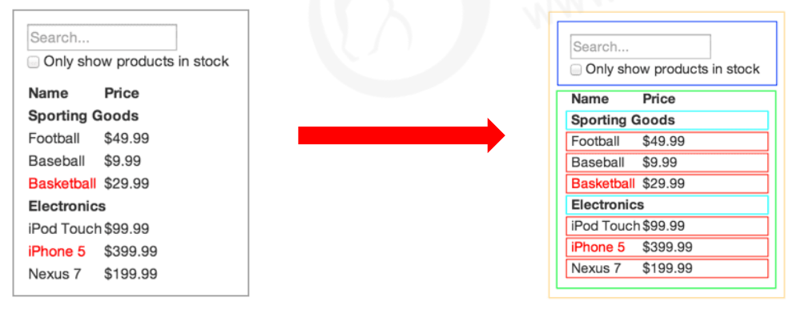

# React基础


## 1. React 概述


### 1.1 什么是 React

- React 是一个用于构建用户界面的 JavaScript 库

- 用户界面：HTML页面（前端）

- React 主要用来写HTML页面，或构建Web应用

- 如果从 MVC 的角度来看，React 仅仅是视图层（V），也就是只负责视图的渲染，而并非提供了 完整的 M 和 C 的功能。

- React 起源于 Facebook 的内部项目，后又用来架设 Instagram 的网站，并于 2013 年 5 月开源


### 1.2 React 的特点

1. 声明式

你只需要描述 UI（HTML）看起来是什么样，就跟写HTML一样

 React 负责渲染 UI，并在数据变化时更新 UI

```react
const jsx = <div className="app">
<h1>Hello React! 动态变化数据：{count}</h1>
</div>
```

2. 基于组件

- 组件是 React 最重要的内容 
- 组件表示页面中的部分内容 
- 组合、复用多个组件，可以实现完整的页面功能



3. 学习一次，随处使用

- 使用 React 可以开发 Web 应用 
- 使用 React 可以开发移动端原生应用（react-native） 
- 使用 React 可以开发 VR（虚拟现实）应用（react 360）


## 2. React 的基本使用


### 2.1 React 的安装

安装命令：

```
npm i react react-dom
```

- react 包是核心，提供创建元素、组件等功能 
- react-dom 包提供 DOM 相关功能等


### 2.2 React 的使用

1. 引入 react 和 react-dom 两个 js 文件

```react
<script src="./node_modules/react/umd/react.development.js"></script>
<script src="./node_modules/react-dom/umd/react-dom.development.js"></script>
```

2. 创建 React 元素

3. 渲染 React 元素到页面中

```react
<div id="root"></div>
<script>
 // React.createElement不常用，知道即可。返回值：React元素
// 第一个参数：要创建的React元素名称
// 第二个参数：该React元素的属性
// 第三个及其以后的参数：该React元素的子节点
const title = React.createElement('h1', null, 'Hello React')
 // 第一个参数：要渲染的React元素
// 第二个参数：DOM对象，用于指定渲染到页面中的位置
ReactDOM.render(title, document.getElementById('root'))
</script>
```


## 3. React 脚手架的使用


### 3.1 React 脚手架意义

1. 脚手架是开发 现代Web 应用的必备。 
2.  充分利用 Webpack、Babel、ESLint 等工具辅助项目开发。
3. 零配置，无需手动配置繁琐的工具即可使用。 
4. 关注业务，而不是工具配置。


### 3.2 使用 React 脚手架初始化项

**npx 命令介绍**

- npm v5.2.0 引入的一条命令 
-  目的：提升包内提供的命令行工具的使用体验 
- 原来：先安装脚手架包，再使用这个包中提供的命令 
- 现在：无需安装脚手架包，就可以直接使用这个包提供的命令

1. 推荐使用：`npx create-react-app my-app` 

2. `npm init react-app my-app` 

3. `yarn create react-app my-app` 

   **补充：**

-  yarn 是 Facebook 发布的包管理器，可以看做是 npm 的替代品，功能与 npm 相同 
-  yarn 具有快速、可靠和安全的特点 
- 初始化新项目：`yarn init` 
- 安装包： `yarn add 包名称` 
- 安装项目依赖项： yarn 
- 其他命令，请参考yarn文档 

``

### 3.3 在脚手架中使用 React

1. 导入 react 和 react-dom 两个包。

```react
import React from 'react'//因为脚手架引入了webpack，所以可以import
import ReactDOM from 'react-dom'
```

2. 调用 `React.createElement()` 方法创建 react 元素。

3. 调用 `ReactDOM.render()` 方法渲染 react 元素到页面中


## 4. 总结

**React** **基础** 

1. React是构建用户界面的**JavaScript库** 
2. 使用 react 时，**推荐使用脚手架方式**
3. 初始化项目命令：`npx create-react-app my-app`  
4. 启动项目命令：`yarn start（或 npm start）`。 
5. `React.createElement()` 方法用于创建 react 元素（知道）
6. `ReactDOM.render()` 方法负责渲染 react 元素到页面中