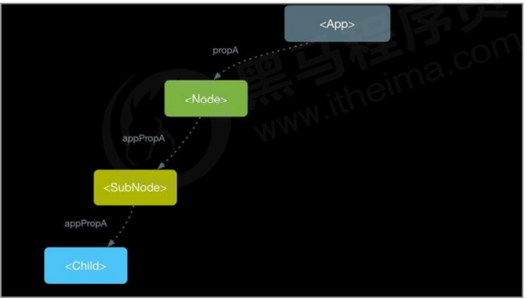
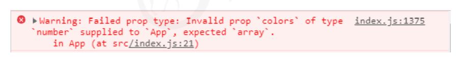
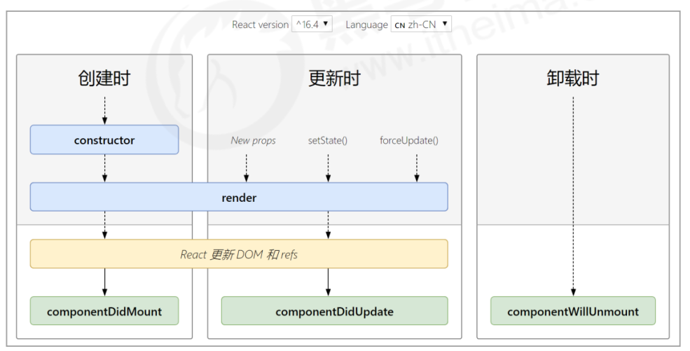

# React 组件进阶


## 1. 组件通讯介绍

组件是**独立且封闭的单元**，默认情况下，只能使用组件自己的数据。在组件化过程中，我们将一个完整的功能 拆分成多个组件，以更好的完成整个应用的功能。而在这个过程中，多个组件之间不可避免的要共享某些数据 。为了实现这些功能，就需要**打破组件的独立封闭性，让其与外界沟通**。这个过程就是**组件通讯**。


## 2. 组件的 props

- 组件是封闭的，要接收外部数据应该通过 props 来实现 
- props的作用：接收传递给组件的数据 
- 传递数据：给组件标签添加属性 
-  接收数据：函数组件通过参数props接收数据，类组件通过 `this.props` 接收数据

```react
<Hello name="jack" age={19} />
function Hello(props) {
   console.log(props)
   return (
     <div>接收到数据：{props.name}</div>
   )
}
```

```react
class Hello extends React.Component {
   render() {
     return (
       <div>接收到的数据：{this.props.age}</div>
     )
   }
}
<Hello name="jack" age={19} />
```

**特点**

- 可以给组件传递任意类型的数据 
- props 是只读的对象，只能读取属性的值，无法修改对象 
- 注意：使用类组件时，如果写了构造函数，应该将 props 传递给 super()，否则，无法在构造函数中获取到 props！

```react
class Hello extends React.Component {
   constructor(props) {
     // 推荐将props传递给父类构造函数
     super(props)
   }
   render() {
     return <div>接收到的数据：{this.props.age}</div>
   }
}
```


## 3. 组件通讯的三种方式


### 3.1 父组件传递数据给子组件

1. 父组件提供要传递的state数据 
2. 给子组件标签添加属性，值为 `state` 中的数据 
3. 子组件中通过 `props` 接收父组件中传递的数据

```react
class Parent extends React.Component {
   state = { lastName: '王' }
   render() {
     return (
       <div>
         传递数据给子组件：<Child name={this.state.lastName} />
       </div>
     )
   }
}
```

```react
function Child(props) {
   return <div>子组件接收到数据：{props.name}</div>
}
```


### 3.2 子组件传递数据给父组件

思路：利用**回调函数**，父组件提供回调，子组件调用，将要传递的数据作为回调函数的参数。

1. 父组件提供一个回调函数（用于接收数据） 
2.  将该函数作为属性的值，传递给子组件
3. 子组件通过 props 调用回调函数
4. 将子组件的数据作为参数传递给回调函数

```react
class Parent extends React.Component {
   getChildMsg = (msg) => {
     console.log('接收到子组件数据', msg)
   }
   render() {
     return (
       <div>
         子组件：<Child getMsg={this.getChildMsg} />
       </div>
     )
   }
}
```

```react
class Child extends React.Component {
   state = { childMsg: 'React' } 
   handleClick = () => {
     this.props.getMsg(this.state.childMsg)
   }
   return (
     <button onClick={this.handleClick}>点我，给父组件传递数据</button>
   )
}
```


### 3.3 兄弟组件

- 将共享**状态提升到最近的公共父组件中**，由公共父组件管理这个状态 
- 思想：**状态提升** 
- 公共父组件职责：1. 提供共享状态 2. 提供操作共享状态的方法
-  要通讯的子组件只需通过 `props` 接收状态或操作状态的方法


## 4. Context 

**思考**：App组件要传递数据给 Child 组件，该如何处理？

处理方式：使用 props 一层层组件往下传递（繁琐）



**更好的姿势**：使用 Context

作用：跨组件传递数据（比如：主题、语言等）

**使用步骤**：

1. 调用 `React. createContext()` 创建 Provider（提供数据） 和 Consumer（消费数据） 两个组件。

```react
const { Provider, Consumer } = React.createContext()
```

2. 使用 Provider 组件作为父节点。

```react
<Provider>
   <div className="App">
     <Child1 />
   </div>
</Provider>
```

3. 设置 value 属性，表示要传递的数据。

```react
<Provider value="pink">
```

4. 调用 Consumer 组件接收数据。

```react
<Consumer>
   {data => <span>data参数表示接收到的数据 -- {data}</span>}
</Consumer>
```

**总结**：

1. 如果两个组件是远方亲戚（比如，嵌套多层）可以使用Context实现组件通讯 
2. Context提供了两个组件：Provider 和 Consumer 
3.  Provider组件：用来提供数据 
4. Consumer组件：用来消费数据


## 5. props 深入


### 5.1 children 属性

- children 属性：表示组件标签的子节点。当组件标签有子节点时，props 就会有该属性 
- children 属性与普通的props一样，值可以是任意值（文本、React元素、组件，甚至是函数）

```react
function Hello(props) {
   return (
     <div>
       组件的子节点：{props.children}
     </div>
   )
}
<Hello>我是子节点</Hello>
```


### 5.2 props 校验

- 对于组件来说，props 是外来的，无法保证组件使用者传入什么格式的数据
-  如果传入的数据格式不对，可能会导致组件内部报错 
- 关键问题：组件的使用者不知道明确的错误原因

```react
// 小明创建的组件App
function App(props) {
   const arr = props.colors
   const lis = arr.map((item, index) => <li key={index}>{item.name}</li>)
   return (
     <ul>{lis}</ul>
   )
}
// 小红使用组件App
<App colors={19} />
```

-  props 校验：允许在创建组件的时候，就指定 props 的类型、格式等 
- 作用：捕获使用组件时因为props导致的错误，给出明确的错误提示，增加组件的健壮性

```react
App.propTypes = {
   colors: PropTypes.array
}
```



**使用步骤**

1. 安装包 prop-types （ `npm i props-types`） 
2. 导入 prop-types 包 
3. 使用组件名`.propTypes = {}` 来给组件的props添加校验规则 
4. 校验规则通过 `PropTypes` 对象来指定

```react
import PropTypes from 'prop-types'
function App(props) {
   return (
     <h1>Hi, {props.colors}</h1>
   )
}
App.propTypes = {
   // 约定colors属性为array类型
   // 如果类型不对，则报出明确错误，便于分析错误原因
   colors: PropTypes.array
}
```

**约束规则**

1. 常见类型：`array、bool、func、number、object、string` 
2.  React元素类型：`element` 
3. 必填项：`isRequired` 
4. 特定结构的对象：`shape({ })`

```react
// 常见类型
optionalFunc: PropTypes.func,
// 必选
requiredFunc: PropTypes.func.isRequired,
// 特定结构的对象
optionalObjectWithShape: PropTypes.shape({
   color: PropTypes.string,
   fontSize: PropTypes.number
})
```


### 5.3 props 的默认值

- 场景：分页组件 -> 每页显示条数 
- 作用：给 props 设置默认值，在未传入 props 时生效

```react
function App(props) {
   return (
     <div>
       此处展示props的默认值：{props.pageSize}
     </div>
   )
}
// 设置默认值
App.defaultProps = {
   pageSize: 10
}
// 不传入pageSize属性
<App />
```


## 6. 组件的生命周期


### 6.1 组件的生命周期概述

- 意义：组件的生命周期有助于理解组件的运行方式、完成更复杂的组件功能、分析组件错误原因等 
- **组件的生命周期：组件从被创建到挂载到页面中运行，再到组件不用时卸载的过程** 
- 生命周期的每个阶段总是伴随着一些方法调用，这些方法就是**生命周期的钩子函数。** 
- 钩子函数的作用：为开发人员在不同阶段操作组件提供了时机。 
- **只有 类组件 才有生命周期**。


### 6.2 生命周期的三个阶段

1. 每个阶段的执行时机 
2. 每个阶段钩子函数的执行顺序 
3. 每个阶段钩子函数的作用



| 阶段名称           | 执行时机                                                  |      |
| ------------------ | --------------------------------------------------------- | ---- |
| 创建时(挂载阶段)   | 组件创建时（页面加载时）                                  |      |
| 更新时（更新阶段） | 1. `setState()` 2. `forceUpdate()` 3. 组件接收到新的props |      |
| 卸载时（卸载阶段） | 组件从页面中消失                                          |      |

**创建时：**

执行顺序：

`constructor()`——> `render()`——> `componentDidMount`

| 钩子函数          | 触发时机                  | 作用                                      |
| ----------------- | ------------------------- | ----------------------------------------- |
| constructor       | 创建组件时，最先执行      | 1. 初始化state  2. 为事件处理程序绑定this |
| render            | 每次组件渲染都会触发      | 渲染UI（注意：不能调用setState()）        |
| componentDidMount | 组件挂载（完成DOM渲染）后 | 1. 发送网络请求 2. DOM操作                |

**更新时**

执行顺序：

`render()` ——>`componentDidUpdate()`

| 钩子函数           | 触发时机                  | 作用                                                         |
| ------------------ | ------------------------- | ------------------------------------------------------------ |
| render             | 每次组件渲染都会触发      | 渲染UI（与 挂在阶段 是同一个render）                         |
| componentDidUpdate | 组件更新（完成DOM渲染）后 | 1. 发送网络请求  2 .DOM操作 注意：如果要setState() 必须放在一个if条件中 |

**卸载时**

| 钩子函数             | 触发时机                 | 作用                               |
| -------------------- | ------------------------ | ---------------------------------- |
| componentWillUnmount | 组件卸载（从页面中消失） | 执行清理工作（比如：清理定时器等） |


## 7. render-props和高阶组件


### 7.1 React组件复用概述

- 思考：如果两个组件中的部分功能相似或相同，该如何处理？ 
- 处理方式：复用相似的功能（联想函数封装） 
- 复用什么？1. **state** 2. **操作state的方法** （组件状态逻辑 ） 
-  两种方式：**1. render props模式 2. 高阶组件（HOC）** 
-  注意：这两种方式**不是新的API**，而是利用React自身特点的编码技巧，演化而成的固定模式（写法）

### 7.2 render props 模式

**思路分析**

- 思路：将要复用的state和操作state的方法封装到一个组件中 
- 问题1：如何拿到该组件中复用的state？
-  在使用组件时，添加一个值为函数的prop，通过 函数参数 来获取（需要组件内部实现）
- 问题2：如何渲染任意的UI？
- 使用该函数的返回值作为要渲染的UI内容（需要组件内部实现）

```react
<Mouse render={(mouse) => {}}/>
```

```react
<Mouse render={(mouse) => (
   <p>鼠标当前位置 {mouse.x}，{mouse.y}</p>
)}/
```

**使用步骤**

- 创建Mouse组件，在组件中提供复用的状态逻辑代码（1. 状态 2. 操作状态的方法） 
- 将要复用的状态作为 props.render(state) 方法的参数，暴露到组件外部 
- 使用 props.render() 的返回值作为要渲染的内容

```react
class Mouse extends React.Component {
   // … 省略state和操作state的方法
   render() {
     return this.props.render(this.state)
   }
}
```

```react
<Mouse render={(mouse) => <p>鼠标当前位置 {mouse.x}，{mouse.y}</p>}/>
```

**演示Mouse组件的复用**

- Mouse组件负责：封装复用的状态逻辑代码（1. 状态 2. 操作状态的方法）
-  状态：鼠标坐标（x, y） 
-  操作状态的方法：鼠标移动事件
-  传入的render prop负责：使用复用的状态来渲染UI结构

```react
class Mouse extends React.Component {
   // … 省略state和操作state的方法
   render() {
     return this.props.render(this.state)
   }
}
```

```react
<Mouse render={(mouse) => <p>鼠标当前位置 {mouse.x}，{mouse.y}</p>}/>
```

**children代替render属性**

- 注意：并不是该模式叫 render props 就必须使用名为render的prop，实际上可以使用任意名称的prop 
- 把prop是一个函数并且告诉组件要渲染什么内容的技术叫做：render props模式 
- 推荐：使用 children 代替 render 属性

```react
<Mouse>
   {({x, y}) => <p>鼠标的位置是 {x}，{y}</p> }
</Mouse>
// 组件内部：
this.props.children(this.state)
```

```react
// Context 中的用法：
<Consumer>
   {data => <span>data参数表示接收到的数据 -- {data}</span>}
</Consumer>
```

**代码优化**

1. 推荐：给 render props 模式添加 props校验 
2. 应该在组件卸载时解除 mousemove 事件绑定

```react
Mouse.propTypes = {
   chidlren: PropTypes.func.isRequired
}
```

```react
componentWillUnmount() {
   window.removeEventListener('mousemove', this.handleMouseMove)
}
```


### 7.3 高阶组件

**概述**

- 目的：**实现状态逻辑复用** 
- 采用 **包装（装饰）模式** ，比如说：手机壳 
- 手机：获取保护功能 
- 手机壳 ：提供保护功能 
- 高阶组件就相当于手机壳，通过包装组件，增强组件功能

**思路分析**

- **高阶组件**（HOC，Higher-Order Component）是**一个函数**，接收要包装的组件，返回**增强后的组件**
-  高阶组件内部创建一个类组件，在这个类组件中提供复用的状态逻辑代码，通过prop将复用的状态传递给 被包装组件 WrappedComponent

```react
const EnhancedComponent = withHOC(WrappedComponent)
```

```react
// 高阶组件内部创建的类组件：
class Mouse extends React.Component {
   render() {
     return <WrappedComponent {...this.state} />
   }
}
```

**使用步骤**

1. 创建一个函数，名称约定以 with 开头

```react
function withMouse() {}
```

2. 指定函数参数，参数应该以大写字母开头（作为要渲染的组件）

```react
function withMouse(WrappedComponent) {}
```

3. 在函数内部创建一个类组件，提供复用的状态逻辑代码，并返回

```react
function withMouse(WrappedComponent) {
   class Mouse extends React.Component {}
   return Mouse
}
```

4. 在该组件中，渲染参数组件，同时将状态通过prop传递给参数组件

```react
// Mouse组件的render方法中：
return <WrappedComponent {...this.state} />
```

5. 调用该高阶组件，传入要增强的组件，通过返回值拿到增强后的组件，并将其渲染到页面中

```react
// 创建组件
const MousePosition = withMouse(Position)
// 渲染组件
<MousePosition />
```

**设置displayName**

- 使用高阶组件存在的问题：得到的两个组件名称相同 
- 原因：默认情况下，React使用组件名称作为 displayName 
-  解决方式：为 高阶组件 设置 displayName 便于调试时区分不同的组件 
- displayName的作用：用于设置调试信息（React Developer Tools信息） 
- 设置方式：

```react
Mouse.displayName = `WithMouse${getDisplayName(WrappedComponent)}`

function getDisplayName(WrappedComponent) {
   return WrappedComponent.displayName || WrappedComponent.name || 'Component'
}
```

**传递props**

-  问题：props丢失 
- 原因：高阶组件没有往下传递props
-  解决方式：渲染 WrappedComponent 时，将 state 和 this.props 一起传递给组件 
- 传递方式：

```react
<WrappedComponent {...this.state} {...this.props} />
```


## 8. React组件进阶总结

**React 组件进阶** 

1. 组件通讯是构建 React 应用必不可少的一环。
2. props 的灵活性让组件更加强大。
3.  状态提升是React组件的常用模式。
4.  组件生命周期有助于理解组件的运行过程。 
5. 钩子函数让开发者可以在特定的时机执行某些功能。 
6. render props模式和高阶组件都可以实现组件状态逻辑复用。 
7. 组件极简模型： (state, props) => UI