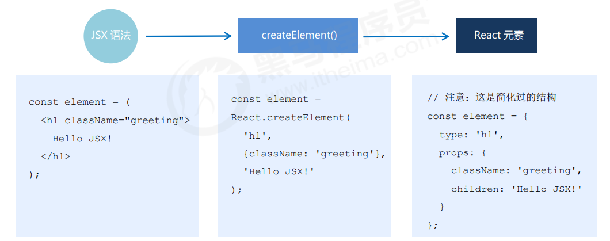
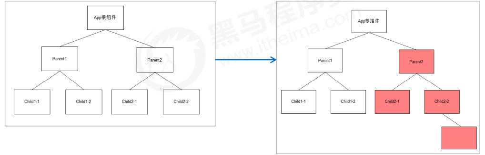
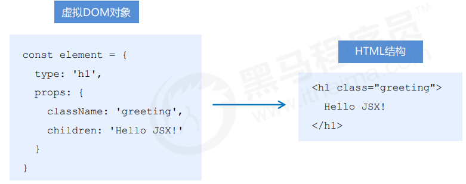
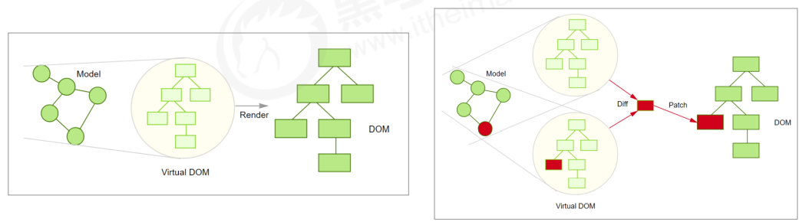

# React 原理揭秘


## 1. setState() 的说明


### 1.1 更新数据

- setState() 是异步更新数据的 
-  注意：使用该语法时，后面的 setState() 不要依赖于前面的 setState() 
-  可以多次调用 setState() ，只会触发一次重新渲染

```react
this.state = { count: 1 }
this.setState({
   count: this.state.count + 1
})
console.log(this.state.count) // 1
```


### 1.2 推荐语法

- 推荐：使用 `setState((state, props) => {})` 语法 
-  参数state：表示最新的state 
-  参数props：表示最新的props

```react
this.setState((state, props) => {
   return {
     count: state.count + 1
   }
})
console.log(this.state.count) // 1
```


### 1.3 第二个参数

- 场景：在状态更新（页面完成重新渲染）后立即执行某个操作 
-  语法： `setState(updater[, callback])` 

```react
this.setState(
   (state, props) => {},
   () => {console.log('这个回调函数会在状态更新后立即执行')}
)
```

```react
this.setState(
   (state, props) => {},
   () => {
     document.title = '更新state后的标题：' + this.state.count
   }
)
```


## 2.  JSX 语法的转化过程

- JSX 仅仅是 `createElement()` 方法的语法糖（简化语法） 
- JSX 语法被 @babel/preset-react 插件编译为 `createElement()` 方法 
- React 元素：是一个对象，用来描述你希望在屏幕上看到的内容




##  3. 组件更新机制

- setState() 的两个作用： 1. 修改 state 2. 更新组件（UI） 
- 过程：父组件重新渲染时，也会重新渲染子组件。但只会渲染当前组件子树（当前组件及其所有子组件）




## 4. 组件性能优化


### 4.1 减轻 state

- 减轻 state：只存储跟组件渲染相关的数据（比如：count / 列表数据 / loading 等） 
- 注意：不用做渲染的数据不要放在 state 中，比如定时器 id等 
- 对于这种需要在多个方法中用到的数据，应该放在 this 中

```react
class Hello extends Component {
   componentDidMount() {
     // timerId存储到this中，而不是state中
     this.timerId = setInterval(() => {}, 2000)
   }
   componentWillUnmount() {
     clearInterval(this.timerId)
   }
   render() { … }
}
```


### 4.2 避免不必要的重新渲染

- 组件更新机制：父组件更新会引起子组件也被更新，这种思路很清晰 
- 问题：子组件没有任何变化时也会重新渲染
-  如何避免不必要的重新渲染呢？ 
- 解决方式：使用钩子函数 shouldComponentUpdate(nextProps, nextState) 
- 作用：通过返回值决定该组件是否重新渲染，返回 true 表示重新渲染，false 表示不重新渲染 
- 触发时机：更新阶段的钩子函数，组件重新渲染前执行 （shouldComponentUpdate ——>render）

```react
class Hello extends Component {
   shouldComponentUpdate() {
     // 根据条件，决定是否重新渲染组件
     return false
   }
   render() {…}
}
```

**案例：随机数**

```react
class Hello extends Component {
   shouldComponentUpdate(nextProps, nextState) {
     return nextState.number !== this.state.number
}
   render() {…}
}
```


### 4.3 纯组件

-  纯组件：PureComponent 与 React.Component 功能相似
-  区别：PureComponent 内部自动实现了 shouldComponentUpdate 钩子，不需要手动比较
-  原理：纯组件内部通过分别 对比 前后两次 props 和 state 的值，来决定是否重新渲染组件

```react
class Hello extends React.PureComponent {
   render() {
     return (
       <div>纯组件</div>
     )
   }
}
```

 **说明：纯组件内部的对比是 shallow compare（浅层对比）** 

1. 对于值类型来说：比较两个值是否相同（直接赋值即可，没有坑）

```react
let number = 0
let newNumber = number
newNumber = 2
console.log(number === newNumber) // false
```

```react
state = { number: 0 }
setState({
   number: Math.floor(Math.random() * 3)
})
// PureComponent内部对比：
最新的state.number === 上一次的state.number // false，重新渲染组件
```

2. 对于引用类型来说：只比较对象的引用（地址）是否相同

```react
const obj = { number: 0 }
const newObj = obj
newObj.number = 2
console.log(newObj === obj) // true
```

```react
state = { obj: { number: 0 } }
// 错误做法
state.obj.number = 2
setState({ obj: state.obj })
// PureComponent内部比较：
最新的state.obj === 上一次的state.obj // true，不重新渲染组件
```

3. 注意：state 或 props 中属性值为引用类型时，应该创建新数据，不要直接修改原数据！

```react
// 正确！创建新数据
const newObj = {...state.obj, number: 2}
setState({ obj: newObj })
// 正确！创建新数据
// 不要用数组的push / unshift 等直接修改当前数组的的方法
// 而应该用 concat 或 slice 等这些返回新数组的方法
this.setState({
   list: [...this.state.list, {新数据}]
})
```


## 5. 虚拟 DOM 和 Diff 算法

- React 更新视图的思想是：只要 state 变化就重新渲染视图 
- 特点：思路非常清晰 
- 问题：组件中只有一个 DOM 元素需要更新时，也得把整个组件的内容重新渲染到页面中？ 不是
- 理想状态：部分更新，只更新变化的地方。 
- 问题：React 是如何做到部分更新的？  虚拟 DOM 配合 Diff 算法

虚拟 DOM：本质上就是一个 **JS 对象**，用来描述你希望在屏幕上看到的内容（UI）。



**执行过程**

1. 初次渲染时，React 会根据初始state（Model），创建一个**虚拟 DOM 对象（树）**。 
2. 根据虚拟 DOM 生成真正的 DOM，渲染到页面中。 
3. 当数据变化后（setState()），重新根据新的数据，创建新的虚拟DOM对象（树）。 
4. 与上一次得到的虚拟 DOM 对象，使用 **Diff 算法 对比**（找不同），得到需要更新的内容。 
5. 最终，React 只将**变化的内容**更新（patch）到 DOM 中，重新渲染到页面。



**代码演示**

- 组件 render() 调用后，根据 状态 和 JSX结构 生成虚拟DOM对象 
- 示例中，只更新 p 元素的文本节点内容

```react
{
   type: 'div',
   props: {
     children: [
       { type: 'h1', props: {children: '随机数'} },
       { type: 'p', props: {children: 0} }
     ]
   }
}
```

```react
// ...省略其他结构
{ type: 'p', props: {children: 2} }
```


## 6. React 原理揭秘总结

1. 工作角度：应用第一，原理第二。 (先会用再去探索原理，不必一上来就深入原理部分)
2. 原理有助于更好地理解 React 的自身运行机制。 
3. setState()异步更新数据。 
4. 父组件更新导致子组件更新，纯组件提升性能。 
5. 思路清晰简单为前提，虚拟 DOM 和 Diff 保效率。 
6. 虚拟 DOM = state + JSX。 
7. 虚拟 DOM 的真正价值从来都不是性能，真正价值是解决浏览器兼容性(跨域)。